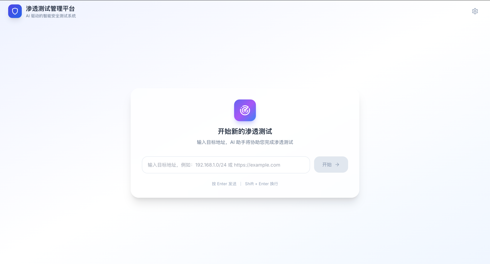
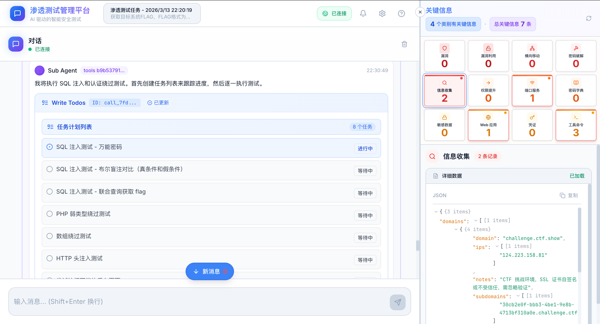

# Abyss

> 探索数字世界的“九幽之下”——基于人工智能的自主渗透测试框架

[](https://www.python.org/downloads/)
[](LICENSE)
[](https://www.docker.com/)

## 📖 简介

**Abyss** 是一个基于人工智能的自主渗透测试框架。与传统自动化扫描工具不同，Abyss 能够**像人类安全专家一样自主思考**，通过递进式渗透策略，从单点漏洞逐步深入，最终抵达系统最深处——正如其名，探索数字世界的“九幽之下”。

Abyss 不仅仅是一个工具集合，而是一个**具备思考和决策能力**的渗透测试系统。它通过多智能体协作、动态学习和系统化的渗透方法论，实现真正意义上的自主渗透测试。

## ✨ 核心特点

### 🧠 多智能体协作
- **调度智能体**：统筹规划渗透测试整体流程，分配任务
- **执行智能体**：具体执行渗透测试命令和操作
- **分析智能体**：分析渗透结果，总结经验，优化后续策略

### 🎯 递进式渗透
- 从单点漏洞出发，自主发现渗透目标薄弱点
- 智能探索渗透路径，逐步深入系统核心
- 模拟真实攻击者的思维方式和攻击链

### 🔄 动态学习
- 根据渗透过程中的反馈实时调整策略
- 自主分析和总结渗透过程
- 持续积累经验，提升后续渗透成功率

### 📚 方法论驱动
- 基于成熟的渗透测试方法论进行测试
- 非简单命令调用，而是**有策略、有逻辑**的渗透过程
- 系统化方法论指导智能体行为，而非简单堆砌Agent工具

### 👁️ 可视化呈现
- 实时展示渗透过程和智能体思考过程
- 关键信息高亮显示
- 渗透路径可视化追踪

### 🛠️ 全面技能覆盖
- Skill 技能覆盖 **OWASP Top 10:2025** 所有技术
- 持续更新的渗透测试技能库
- 模块化技能设计，易于扩展

## 🏗️ 系统架构

```
┌─────────────────────────────────────────────────────────────────────────────┐
│                                输入层                                        │
│  ┌─────────────────┐  ┌─────────────────┐  ┌─────────────────┐              │
│  │    Web UI       │  │   RESTful API   │  │   WebSocket     │              │
│  │  (Vue/Vite)     │  │   (Flask)       │  │   (实时通信)     │              │
│  └────────┬────────┘  └────────┬────────┘  └────────┬────────┘              │
│           │                    │                    │                       │
│           └────────────────────┼────────────────────┘                       │
│                                │                                            │
│                        HTTP/WebSocket 通信                                   │
└─────────────────────────────────────────────────────────────────────────────┘
                                 │
                                 ▼
┌─────────────────────────────────────────────────────────────────────────────┐
│                             渗透框架层                                        │
│                                                                             │
│  ┌─────────────────────────────────────────────────────────────────────┐    │
│  │                         DeepAgent 框架                               │    │
│  │  ┌──────────────┐  ┌──────────────┐  ┌──────────────┐               │     │
│  │  │  调度智能体   │  │  执行智能体   │  │  分析智能体   │              │   │
│  │  │             │  │              │  │              │              │   │
│  │  │  • 任务规划  │  │  • 命令执行  │  │  • 结果分析  │              │   │
│  │  │  • 策略制定  │  │  • 技能调用  │  │  • 经验总结  │              │   │
│  │  │  • 资源调度  │  │  • 代码编写  │  │  • 策略优化  │              │   │
│  │  └──────┬───────┘  └──────┬───────┘  └──────┬───────┘              │   │
│  │         │                  │                  │                      │   │
│  │         └──────────────────┼──────────────────┘                      │   │
│  │                            │                                          │   │
│  │                   智能体协作机制                                        │   │
│  └─────────────────────────────────────────────────────────────────────┘   │
│                                                                             │
│  ┌─────────────────────────────────────────────────────────────────────┐   │
│  │                          Skill 技能库                                 │   │
│  │                                                                     │   │
│  │  ╔═══════════════════════════════════════════════════════════════╗  │   │
│  │  ║                     渗透测试全生命周期覆盖                      ║  │   │
│  │  ╚═══════════════════════════════════════════════════════════════╝  │   │
│  │                                                                     │   │
│  │  ┌─────────────────────────────────────────────────────────────┐   │   │
│  │  │                    第一阶段：情报收集                        │   │   │
│  │  ├─────────────────────────────────────────────────────────────┤   │   │
│  │  │ • 主动信息收集：端口扫描、服务识别、操作系统指纹             │   │   │
│  │  │ • 被动信息收集：DNS枚举、子域发现、搜索引擎语法               │   │   │
│  │  │ • 目录/文件枚举：敏感文件、备份文件、管理后台                 │   │   │
│  │  │ • 技术栈识别：Web框架、CMS、组件版本                         │   │   │
│  │  └─────────────────────────────────────────────────────────────┘   │   │
│  │                                                                     │   │
│  │  ┌─────────────────────────────────────────────────────────────┐   │   │
│  │  │                    第二阶段：威胁建模                        │   │   │
│  │  ├─────────────────────────────────────────────────────────────┤   │   │
│  │  │ • 攻击面分析：入口点识别、信任边界划分                       │   │   │
│  │  │ • 业务流程梳理：关键功能点、数据流追踪                       │   │   │
│  │  │ • 攻击路径预测：潜在突破口分析                               │   │   │
│  │  └─────────────────────────────────────────────────────────────┘   │   │
│  │                                                                     │   │
│  │  ┌─────────────────────────────────────────────────────────────┐   │   │
│  │  │                    第三阶段：漏洞分析                        │   │   │
│  │  ├─────────────────────────────────────────────────────────────┤   │   │
│  │  │ • 自动化扫描：漏洞库匹配、配置检查                           │   │   │
│  │  │ • 逻辑漏洞挖掘：越权、业务流缺陷、支付绕过                   │   │   │
│  │  │ • 代码级分析：SQL注入、XSS、命令注入                         │   │   │
│  │  │ • 配置缺陷检查：默认凭证、错误配置、敏感信息泄露             │   │   │
│  │  └─────────────────────────────────────────────────────────────┘   │   │
│  │                                                                     │   │
│  │  ┌─────────────────────────────────────────────────────────────┐   │   │
│  │  │                    第四阶段：渗透利用                        │   │   │
│  │  ├─────────────────────────────────────────────────────────────┤   │   │
│  │  │ • 漏洞验证：PoC执行、漏洞复现                               │   │   │
│  │  │ • 漏洞利用：Exploit适配、绕过WAF/IPS                        │   │   │
│  │  │ • 权限获取：Webshell上传、反弹Shell                         │   │   │
│  │  │ • 多步利用：漏洞组合拳、攻击链构建                          │   │   │
│  │  └─────────────────────────────────────────────────────────────┘   │   │
│  │                                                                     │   │
│  │  ┌─────────────────────────────────────────────────────────────┐   │   │
│  │  │                    第五阶段：后渗透                          │   │   │
│  │  ├─────────────────────────────────────────────────────────────┤   │   │
│  │  │ • 权限提升：本地提权、内核漏洞利用                           │   │   │
│  │  │ • 横向移动：内网探测、凭据窃取、会话传递                     │   │   │
│  │  │ • 持久化：后门植入、定时任务、启动项                         │   │   │
│  │  │ • 痕迹清理：日志擦除、文件恢复                               │   │   │
│  │  └─────────────────────────────────────────────────────────────┘   │   │
│  │                                                                     │   │
│  │  ╔═══════════════════════════════════════════════════════════════╗  │   │
│  │  ║                    OWASP Top 10:2025 全量覆盖                 ║  │   │
│  │  ╠═══════════════════════════════════════════════════════════════╣  │   │
│  │  ║  A01:2025-权限控制失效  │  A02:2025-加密机制失效             ║  │   │
│  │  ║  A03:2025-注入型缺陷    │  A04:2025-不安全设计               ║  │   │
│  │  ║  A05:2025-安全配置错误  │  A06:2025-易受攻击组件             ║  │   │
│  │  ║  A07:2025-认证机制失效  │  A08:2025-软件完整性缺陷           ║  │   │
│  │  ║  A09:2025-日志监控缺陷  │  A10:2025-服务端请求伪造           ║  │   │
│  │  ╚═══════════════════════════════════════════════════════════════╝  │   │
│  └─────────────────────────────────────────────────────────────────────┘   │
└─────────────────────────────────────────────────────────────────────────────┘
                                      │
                                      ▼
┌─────────────────────────────────────────────────────────────────────────────┐
│                             输出层                                           │
│  ┌─────────────────┐  ┌─────────────────┐  ┌─────────────────┐            │
│  │   关键信息      │  │   渗透报告      │  │   修复建议      │            │
│  │  • 漏洞详情     │  │  • 渗透过程     │  │  • 技术修复     │            │
│  │  • 攻击路径     │  │  • 风险评级     │  │  • 架构优化     │            │
│  │  • 敏感数据     │  │  • 证据留存     │  │  • 安全加固     │            │
│  └─────────────────┘  └─────────────────┘  └─────────────────┘            │
└─────────────────────────────────────────────────────────────────────────────┘
```

## 🔄 开源渗透测试项目对比

| 对比维度 | **Abyss (本框架)** | **Shannon** | **传统自动化工具 (如 OpenVAS)** | **其他开源框架 (如 Metasploit)** |
| :--- | :--- | :--- | :--- | :--- |
| **核心方法论** | **通用渗透测试方法论驱动**，智能体理解并遵循标准的渗透测试流程（如信息收集、威胁建模、漏洞分析、渗透利用、后渗透）。 | **定向知识注入**，针对特定基准测试（如 `validation-benchmarks`）的知识进行优化。 | 预设规则、插件和签名库的**机械化扫描**。 | 以**漏洞利用代码库**为核心，需人工选择模块和配置。 |
| **智能体知识来源** | 内置标准渗透测试**方法论**与**通用攻击思维**，使智能体具备举一反三的能力。 | **针对特定任务的知识库**，在特定测试集上表现优异，但泛化能力未知。 | **漏洞特征库**，仅能识别已知模式。 | **漏洞利用代码库**，依赖社区贡献和更新。 |
| **泛化能力与可迁移性** | **强**，由于基于方法论而非特定题目，可轻松迁移到新环境、新应用和未知漏洞场景。 | **可能较弱**，高度适配特定基准测试，面对全新测试环境或未注入知识的场景，性能可能显著下降。 | **弱**，完全依赖规则库的覆盖度。 | **中**，取决于可用模块，但缺乏智能串联能力。 |
| **核心驱动力** | 智能体**自主思考与决策**，模拟人类专家的思维链。 | 智能体在特定知识范围内**高效执行**。 | **任务级交互**，用户配置策略后批量执行。 | **命令/模块级交互**，用户手动调用组合模块。 |
| **决策灵活性** | **高度动态**，能根据渗透反馈实时调整攻击路径。 | **有限动态**，可能在已知框架内调整，但遇到知识盲区时灵活性受限。 | **静态**，完全遵循预设流程。 | **有限动态**，脚本或自动化例程能力有限。 |

**Abyss 相较于 Shannon 的核心优势在于**：Shannon 代表了“**专家系统**”思路在 AI 时代的演进，即通过注入特定领域的知识（如针对 `validation-benchmarks` 的解题技巧）来获得优异成绩。而 Abyss 追求的是“**智能体**”的更高境界——**不依赖于针对特定测试集的“刷题式”知识注入，而是让智能体内化标准的渗透测试方法论**。这使得 Abyss 更像一位真正的人类专家：它懂得的是“如何钓鱼”（方法论），而不是“如何钓到某条特定的鱼”（定向知识）。因此，Abyss 具备更强的**泛化能力和可迁移性**，能够从容应对未知的目标、环境和漏洞，而非仅仅在一个固定的benchmark上表现出色。

## 🚀 快速开始

### 环境要求

- **Python**: 3.12 或更高版本
- **内存**: 4GB RAM（推荐 8GB+）
- **磁盘**: 20GB+ 可用空间
- **网络**: 渗透测试系统与目标系统网络可达
- **大模型**: 支持国内外主流大模型（OpenAI、Qwen、ChatGLM、文心一言等）及本地离线部署模型（通过 Ollama、LM Studio 等）

### 安装方式

#### 方式一：本地启动

1. **克隆项目**
```bash
git clone https://github.com/zhanglimao/Abyss.git
cd Abyss
```

2. **配置 Python 环境**
```bash
# 创建虚拟环境（推荐）
python3.12 -m venv venv
source venv/bin/activate  # Linux/Mac
# 或
venv\Scripts\activate  # Windows

# 安装后端依赖
pip install -r requirements.txt
```

3. **配置前端环境**
```bash
cd Abyss_web
npm install
```

4. **启动服务**

**终端1：启动后端服务**
```bash
cd Abyss
python start.py
```
后端服务启动后，你将看到：
- RESTful API 服务器运行在 `http://0.0.0.0:80`
- WebSocket 服务器运行在 `ws://0.0.0.0:8765`

**终端2：启动前端服务**
```bash
cd Abyss_web
npm run dev
```
前端服务将运行在 `http://localhost:3000`

5. **访问 Abyss**
打开浏览器访问 `http://localhost:3000` 即可开始使用。

#### 方式二：Docker 启动（推荐）

1. **构建 Docker 镜像**
```bash
cd Abyss/docker
chmod +x build_image.sh
./build_image.sh
```

2. **创建并启动容器**
```bash
# 返回项目根目录
cd ..

# 创建容器（注意端口映射）
docker create -p 80:80 -p 3000:3000 -p 8765:8765 \
  --name abyss \
  abyss:v0.1

# 启动容器
docker start abyss
```

3. **查看容器运行状态**
```bash
docker ps
```
正常运行时，你将看到类似输出：
```
CONTAINER ID   IMAGE        PORTS                                                                                NAMES
xxxxxx         abyss:v0.1   0.0.0.0:80->80/tcp, 0.0.0.0:3000->3000/tcp, 0.0.0.0:8765->8765/tcp   abyss
```

**执行沙箱**
用于执行实际的渗透测试的环境，采用Docker环境进行构建，不论本地部署还是容器部署都需要构建此沙箱。
- 构建执行沙箱
```bash
cd Abyss/docker/kali
chmod +x build_image.sh
./build_image.sh
```
- 启动执行沙箱
docker run -it --rm -p 23:23 --privileged -v Abyss/key_information:/key_information --name abyss_sandbox abyss-sandbox:v0.1 /usr/sbin/sshd -D

#### 配置大模型API
配置路径：Abyss/llm/.api_key.json
{
    "base_url": "xxx",
    "api_key": "xxx",
    "model_type":"xxx"
}

4. **访问 Abyss**
- Web UI: `http://localhost:3000`
- API 接口: `http://localhost:80`
- WebSocket: `ws://localhost:8765`

**端口说明**：
- `80`: RESTful API 服务端口
- `3000`: Web UI 服务端口
- `8765`: WebSocket 实时通信端口

## ✨ 效果图

---


## 🎯 能力体现：validation-benchmarks 实战穿透力

Abyss 的核心能力，最终体现在对高标准benchmark的穿透力上。我们选择 **[xbow-engineering/validation-benchmarks](https://github.com/xbow-engineering/validation-benchmarks)** 作为试金石，这是一个专注于评估渗透测试系统**真实决策能力**的基准测试套件。

**在 validation-benchmarks 包含的各类渗透任务场景中，Abyss 能够自主完成超过 90% 的渗透测试题目。**

这“90% 完成度”的内涵在于：
*   **全过程覆盖**：从最初的信息收集、漏洞分析，到中期的渗透利用，再到后期的权限维持与痕迹清理，Abyss 能独立跑通完整的渗透链路。
*   **复杂场景应对**：对于需要多步决策、路径选择和动态调整的复杂题目，Abyss 展现出远高于传统工具的完成率。
*   **有效性与效率**：不仅追求“完成”，更关注渗透路径的合理性、攻击策略的有效性以及资源的利用效率，模拟了真实专家的操作质量。
*   **不依赖刷题**：我们强调，这一成绩的取得，并未针对该benchmark进行定向知识注入。它真实反映了Abyss基于通用方法论所具备的、可迁移至任何新环境的**实战穿透力**。

这一成绩有力地证明了Abyss **“方法论驱动、智能体自主思考”** 核心理念的有效性，也标志着其能力已超越简单的工具自动化或定向优化，迈向了具备通用问题解决能力的“**智能渗透**”新阶段。

## 📋 后续工作规划

### 🚧 协同智能体扩展
- [ ] **通知告警智能体**：实时推送渗透测试进展和发现的严重漏洞
- [ ] **Exploit 脚本梳理智能体**：整理和优化漏洞利用脚本
- [ ] **防护设备联动智能体**：与 WAF、IPS 等防护设备联动，验证绕过能力
- [ ] **报告生成智能体**：自动化生成专业级渗透测试报告

### 🎨 UI/UE 优化
- [ ] **多任务管理能力**：同时管理多个渗透测试任务
- [ ] **渗透拓扑可视化**：实时展示网络拓扑和攻击路径
- [ ] **智能体思考过程展示**：可视化智能体的决策过程
- [ ] **交互式渗透控制**：支持人工干预和调整渗透策略

### 💾 数据持久化
- [ ] **渗透过程持久化存储**：支持断点续传和任务恢复
- [ ] **历史记录管理**：方便回溯和对比不同渗透策略
- [ ] **知识库持续积累**：将成功案例添加到知识库中

### 🔒 安全增强
- [x] **执行者智能体沙箱化**：在隔离环境中执行渗透操作
- [x] **资源限制机制**：防止渗透测试影响目标系统稳定性
- [ ] **操作审计日志**：完整记录所有操作行为

### 🛠️ 技能库增强
- [ ] **云原生环境渗透技能**：K8s、Docker、Serverless 等
- [ ] **物联网设备渗透技能**：智能家居、工业控制系统等
- [ ] **移动应用渗透技能**：iOS、Android 应用测试
- [ ] **0-day 漏洞挖掘辅助**：协助发现未知漏洞

## 🤝 贡献指南

我们欢迎所有形式的贡献，包括但不限于：

- 提交 Issue 和 Bug 报告
- 完善文档
- 提交新功能的 Pull Request
- 分享使用经验和案例
- 贡献新的渗透测试技能

## 📄 许可证

本项目采用 MIT 许可证 - 详见 [LICENSE](LICENSE) 文件。

## ⚠️ 免责声明

**Abyss 仅限用于合法的安全测试和教育目的。** 未经授权的渗透测试是违法行为。使用本工具进行的任何非法行为，由使用者自行承担相应责任。


---

**探索数字世界的“九幽之下”，让安全测试更智能。** 🚀
